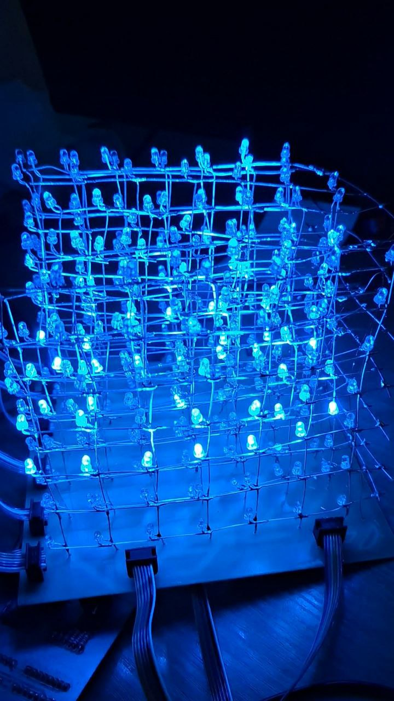

# LED Куб 7x7x7 на Arduino

  
*Компактная 7x7x7 светодиодная матрица с эффектными визуальными эффектами*

  
*Нажмите на изображение для просмотра демонстрационного видео*

## 📌 Описание проекта
Интерактивный светодиодный куб 7x7x7 на Arduino Nano с особенностями:
- 343 индивидуально управляемых светодиода
- 1+ захватывающий световой эффект
- Настраиваемые анимации через Arduino IDE
- Компактный дизайн с управлением через сдвиговые регистры

## 🔧 Компоненты и интрументы
| Компонент        | Описание                          |
|------------------|----------------------------------|
| Микроконтроллер  | Arduino Nano                     |
| Управление LED   | 8x сдвиговых регистров 74HC595  |
| Размеры          | 16×16×16 см                     |
| Тип светодиодов  | 5mm синие рассеянные LED         |

| Инструменты | 
|------------------|
| Фрезерный станок Charlie4U  |
| Паяльная станция | 
Фрезерный станок Charlie4U, паяльная станция

## 🌟 Эффекты, реализуемые позже
1. **Эффект дождя** - Цифровые капли, падающие сквозь куб
2. **Пульсирующий куб** - 3D куб, который расширяется и сжимается
3. **Волновые узоры** - Плавные волнообразные эффекты
4. **Случайные вспышки** - Хаотичные включения светодиодов
5. **Игра Змейка** - Простая 3D анимация змейки

## ✉️ Контакты
По вопросам и поддержке:
- Email1: baisuvakov.ag@phystech.edu
- Email2: merkulov.md@phystech.edu
---
